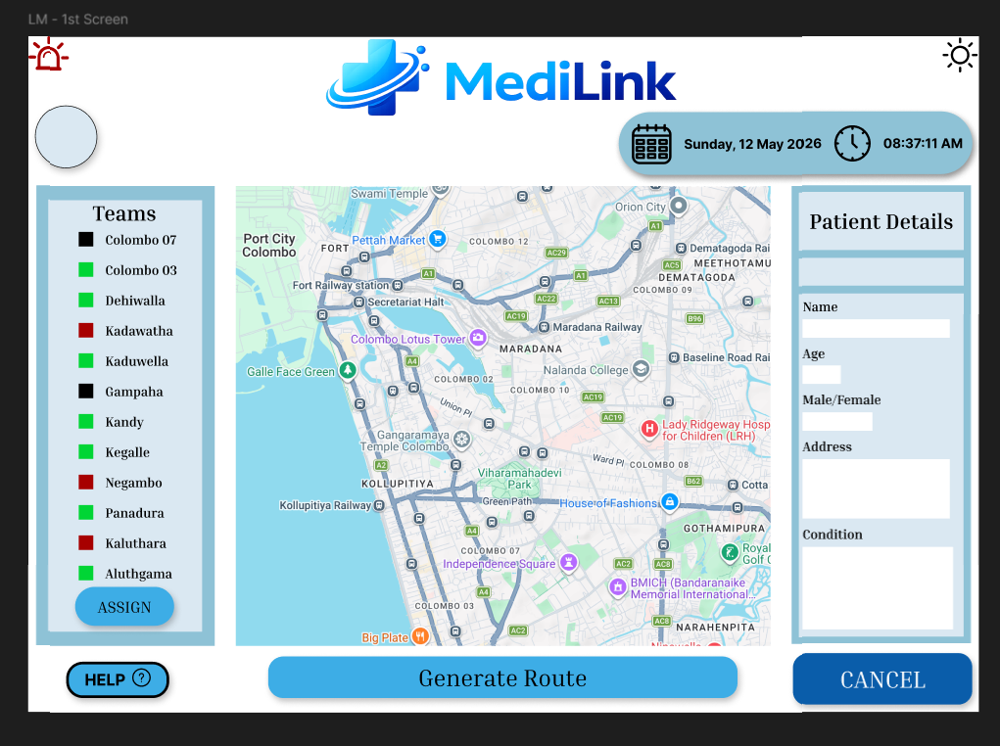
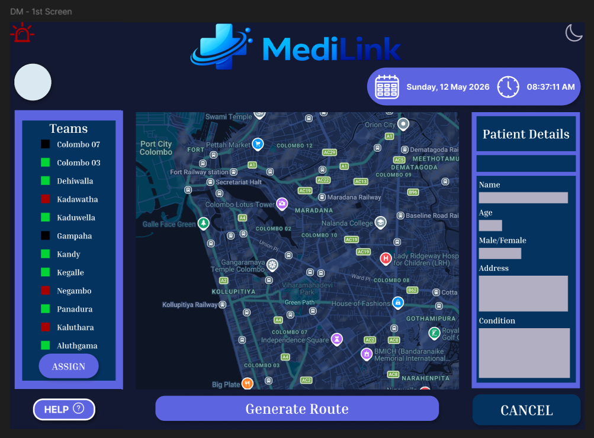
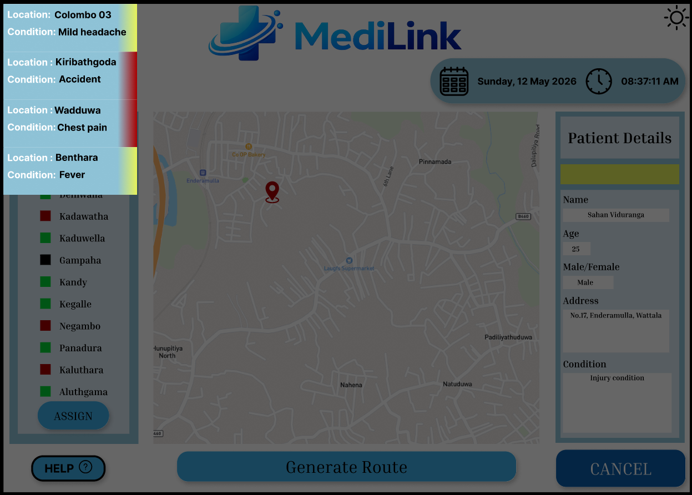
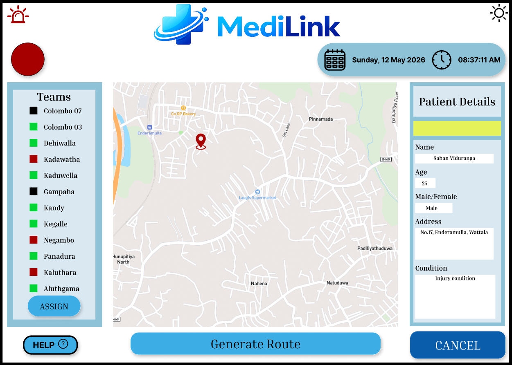
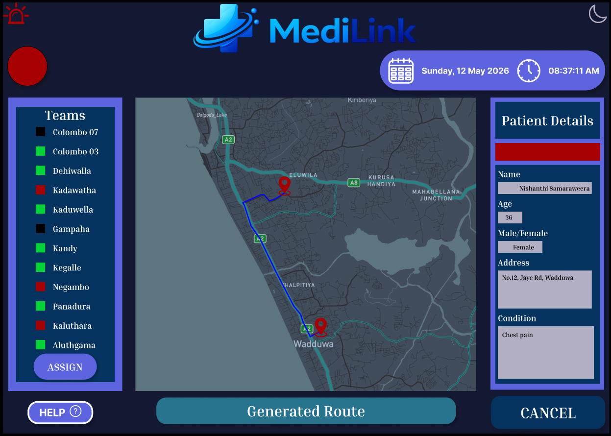
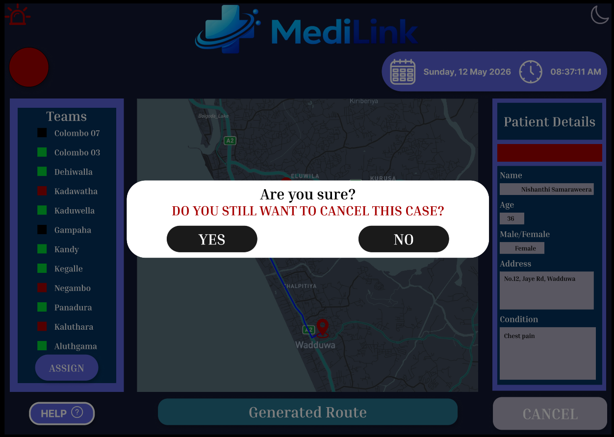

# MediLink-Dashboard---UI-UX
An academic UI/UX project focused on designing an emergency hospital response dashboard. The system features real-time emergency monitoring, patient and team information, and both light and dark mode interfaces to improve usability and accessibility.
## Dashboard — Light Mode

## Dashboard — Dark Mode

## Key Features

### Real-Time Multiple Emergency Monitoring

The dashboard allows dispatchers to monitor multiple emergency cases simultaneously.

### Patient Information & Emergency Status

Displays patient information, emergency status, and real-time patient location.

### Emergency Response Team Management

Allows dispatchers to monitor both patient and response team locations and identify the best route for emergency response.

### Error Prevention

To prevent accidental actions in an emergency situation, the system does not allow an emergency to be cancelled immediately.

### Emergency Priority Indicators

Color coding is used to help dispatchers quickly identify emergency priorities:
- 🔴 **Red** — High-priority emergencies
- 🟡 **Yellow** — Lower-priority emergencies

### Light & Dark Mode

The dashboard includes both **Light Mode and Dark Mode** to accommodate users who may be uncomfortable working with a bright interface for extended periods.

### User-Friendly & Accessible Interface

Blue tones were used throughout the interface to communicate **trust, professionalism, and reliability**, which are important qualities for a hospital emergency response system.

## Design Process

The dashboard was designed with a focus on usability, accessibility, and efficient emergency response workflows. The interface was developed using UX/UI design principles to support hospital dispatchers in monitoring emergencies and managing response teams.

## Tools

- Figma
- UI/UX Design
- Prototyping
- User Flow Design

## Figma Design

The complete Figma `.fig` file is included in this repository.
